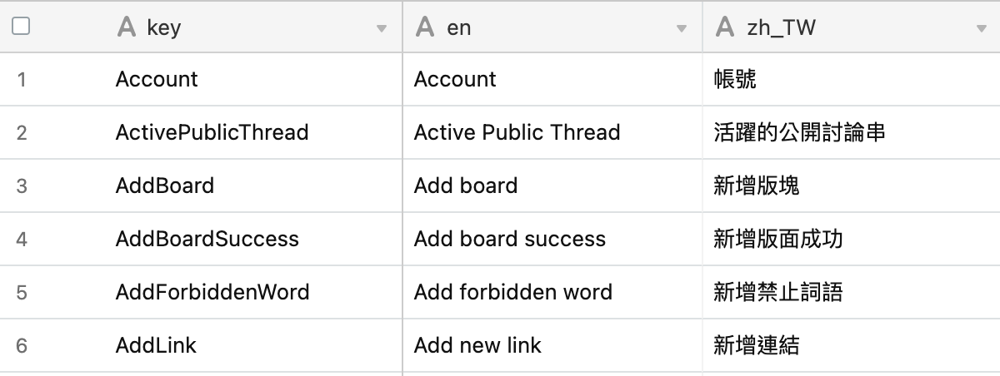

# i18n_airtable

> Convert i18n table to i18n config

## prepare

### airtable

- set your airtable sheet like this



## install

```
yarn add -D https://github.com/skynocover/i18n_airtable.git
```

### .env

- set .env

```
API_KEY=key3Ggyg1aC6C4cd3 // airtable api key
WORKSPACE=apprpRIVLXOL3Tuhp // airtable workspace
TABLE=i18n // airtable table name
```

### package.json

- set package.json

```json
"scripts": {
  "translate": "i18ncreate"
},
```

## translate

```
yarn translate
```

### generate

- config will generate in ./locales/config.json
